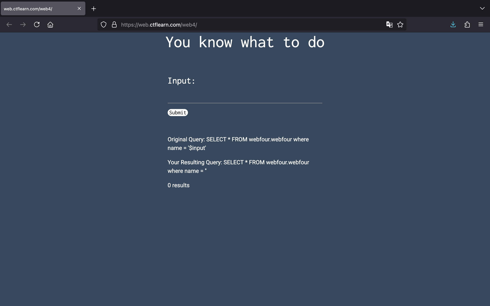
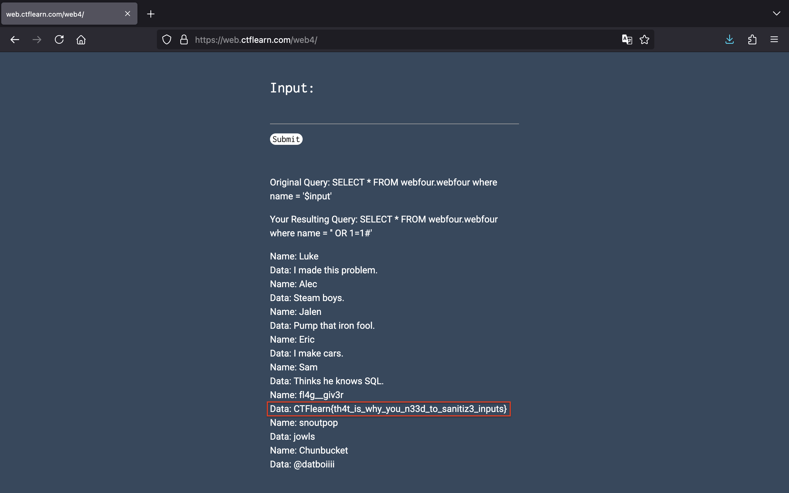

<!-- markdownlint-disable MD033 MD041 -->

<!-- markdownlint-enable MD033 -->

# CTFLEARN

## Basic Injection

See if you can leak the whole database using what you know about SQL Injections. [link](https://web.ctflearn.com/web4/)

Don't know where to begin? Check out CTFlearn's [SQL Injection Lab](https://ctflearn.com/lab/sql-injection-part-1)

### Solution

Vào thử thách, chúng ta có một trang web sau:

Có thể thấy đây là một thử thách liên quan tới lỗ hổng SQL Injection. Và chúng ta sẽ lấy flag thành công với một payload cơ bản `' OR 1=1#`:

### Flag

`CTFlearn{th4t_is_why_you_n33d_to_sanitiz3_inputs}`
