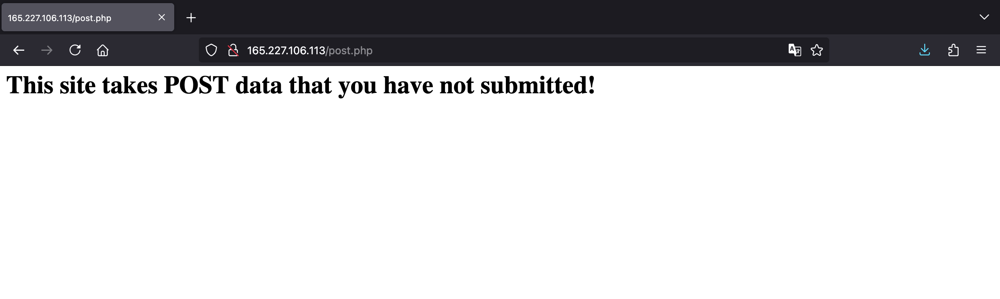
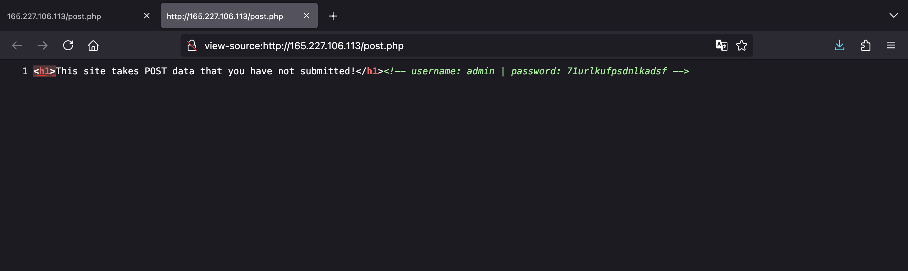
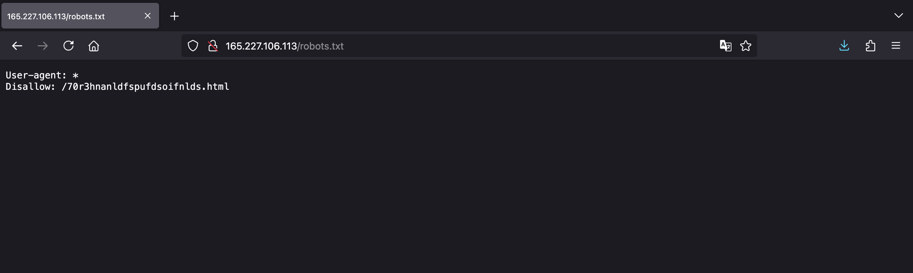
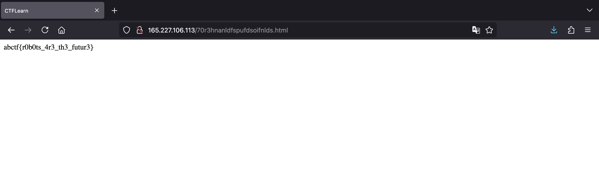
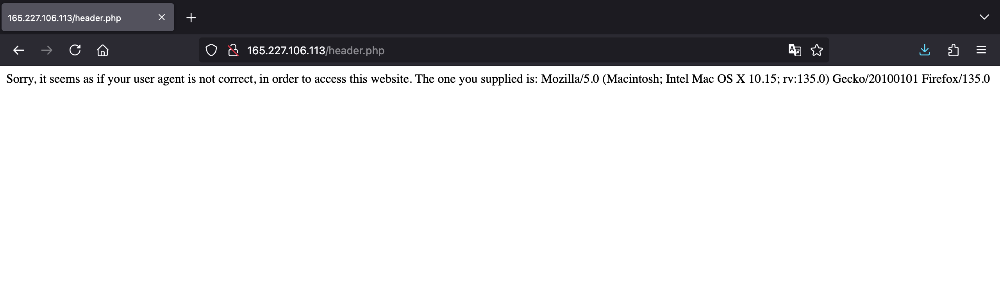
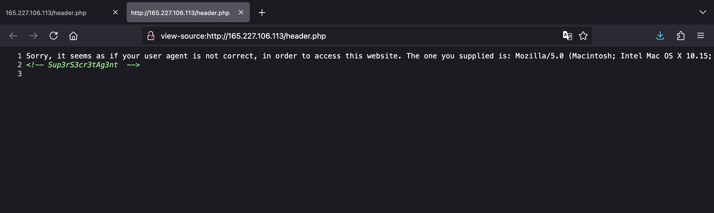
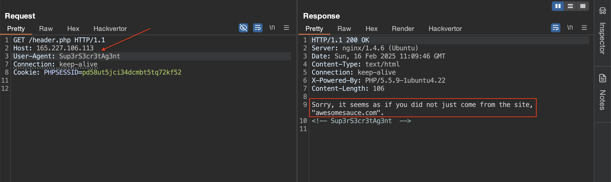
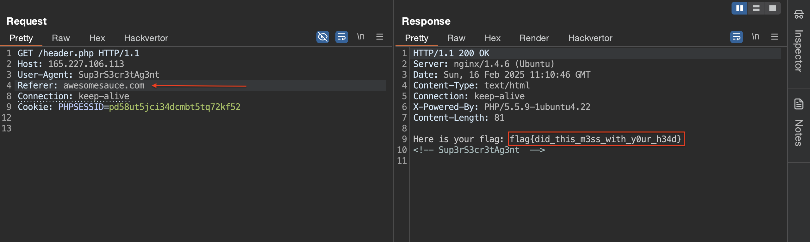

<!-- markdownlint-disable MD033 MD041 MD024-->
<p align="center">
<a href="https://ctflearn.com/"></a>
</p>
<!-- markdownlint-enable MD033 -->

# CTFLEARN

## Basic Injection

See if you can leak the whole database using what you know about SQL Injections. [link](https://web.ctflearn.com/web4/)

Don't know where to begin? Check out CTFlearn's [SQL Injection Lab](https://ctflearn.com/lab/sql-injection-part-1)

### Solution

Vào thử thách, chúng ta có một trang web sau:


Có thể thấy đây là một thử thách liên quan tới lỗ hổng SQL Injection. Và chúng ta sẽ lấy flag thành công với một payload cơ bản `' OR 1=1#`:


### Flag

`CTFlearn{th4t_is_why_you_n33d_to_sanitiz3_inputs}`

## POST Practice

> This website requires authentication, via POST. However, it seems as if someone has defaced our site. Maybe there is still some way to authenticate?
>
> <http://165.227.106.113/post.php>

### Solution

Truy cập vào URL được cung cấp, chúng ta có trang web sau:



Xem HTML source code, chúng ta có thông tin đăng nhập `admin:71urlkufpsdnlkadsf`:



Vào `/robots.txt`, chúng ta thấy `/70r3hnanldfspufdsoifnlds.html` được chỉ định:



Truy cập vào `/70r3hnanldfspufdsoifnlds.html`, chúng ta thấy flag. Tuy nhiên, đó là fake flag:



Vậy để lấy flag, chúng ta sẽ gửi thông tin đăng nhập thông qua POST request sử dụng lệnh `curl`:

```text
$ curl -d "username=admin&password=71urlkufpsdnlkadsf" http://165.227.106.113/post.php 
<h1>flag{p0st_d4t4_4ll_d4y}</h1>
```

### Flag

`flag{p0st_d4t4_4ll_d4y}`

## Don't Bump Your Head(er)

> Try to bypass my security measure on this site! <http://165.227.106.113/header.php>

### Solution

Vào thử thách, trang web bảo chúng ta không thể truy cập vì sai user agent:



Khi xem HTML source code, chúng ta thấy chuỗi `Sup3rS3cr3tAg3nt` được chỉ định trong comment:



Sử dụng Burp Repeater để gửi request, chúng ta đổi giá trị của header `User-Agent` thành `Sup3rS3cr3tAg3nt`. Tiếp tục thấy bảo chúng ta không đến từ `awesomesauce.com`:



Vậy có thể hiểu server yêu cầu chúng ta cung cấp header `Referer` với giá trị `awesomesauce.com`. Thêm header vào và gửi request, chúng ta lụm được flag:



### Flag

`flag{did_this_m3ss_with_y0ur_h34d}`
